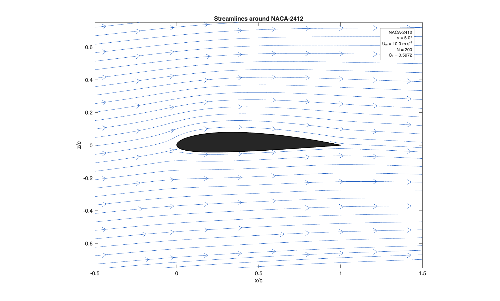
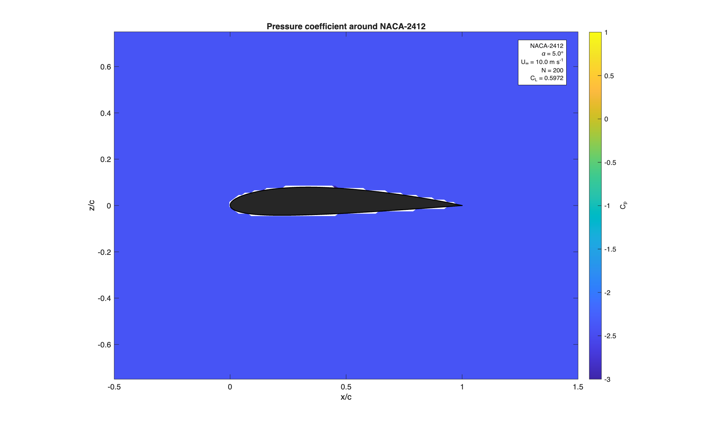
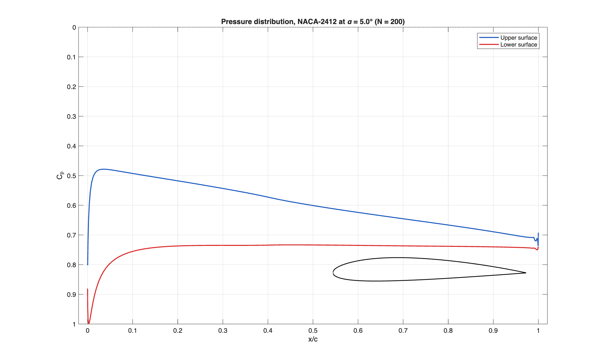

# panel-method

2D panel method solver for NACA 4-digit aerofoils, using constant-strength doublet panels and the Kutta condition. MATLAB.

## Methods

Constant-strength doublet panels, solved with a Kutta condition and an optional gauge-fixing constraint to remove the doublet formulation's null space.

## Build

No build step - MATLAB scripts, run directly.

## Usage

Run `main.m`. Set `choice` near the top to pick a mode:

- `1` - single case, solves one aerofoil/angle and plots the flow field, pressure distribution, and streamlines
- `2` - convergence studies (panel count, wake length, lift curve vs thin-aerofoil theory and XFOIL)
- `3` - automated verification, runs a suite of physical sanity checks
- `4` - batch mode, runs several test cases and plots a comparison chart

Aerofoil, panel count, angle of attack and freestream speed are set near the top of `main.m` as plain variables. Uncomment the `ask_*` lines if you want interactive prompts instead.

## Files

- `main.m` - entry point, picks a mode and runs it
- `functs/panelgen.m` - builds panel coordinates for a NACA 4-digit aerofoil, plus one wake panel
- `functs/panel_geometry.m` - panel midpoints, lengths, angles, tangents and normals
- `functs/cdoublet_vec.m` - velocity induced by a single doublet panel, vectorised
- `functs/panel_strengths.m` - builds and solves the linear system for doublet strength on each panel
- `functs/surface_pressure.m` - gets surface pressure and lift/drag/moment coefficients from the doublet strengths
- `functs/solve_case.m` - runs the whole pipeline for one case (panelgen -> strengths -> pressure)
- `functs/plot_results.m` - velocity vectors, streamlines, Cp contour, and surface pressure plots
- `functs/study_convergence.m` - panel count / wake length / lift curve convergence studies
- `functs/verify_solver.m` - automated checks (symmetry, Kutta condition, convergence to thin-aerofoil theory, etc)
- `data/Xfoil.txt` - reference XFOIL polar for NACA 2412, used in the convergence study lift curve comparison

## Known simplifications

Inviscid, so no real drag or stall - `Cd_press` should sit near zero and is really a check on solver accuracy, not a real drag prediction. `min Cp` below about -8 is flagged as a possible stall condition where the results aren't physically meaningful, since a real (viscous) flow would have separated well before then.

## Validation

Two independent lift estimates are compared on every run: `Cl_kutta` from the circulation (Kutta-Joukowski) and `Cl_press` from integrating the surface pressure. Close agreement between the two is a strong indicator the solver is working correctly. `verify_solver.m` also checks: zero lift for a symmetric aerofoil at zero angle of attack, antisymmetric lift with angle of attack, lift slope within 10% of thin-aerofoil theory's 2*pi per radian, satisfaction of the Kutta condition, a closed trailing edge, and a well-conditioned system once the gauge constraint is applied.

## Plots

Example output for a single case (NACA 2412, alpha = 5 deg, N = 200 panels).

### Velocity field

Velocity vectors around the aerofoil.

### Streamlines

Flow streamlines around the aerofoil.

### Pressure coefficient field

Contours of pressure coefficient (Cp) around the aerofoil.

### Surface pressure distribution

Cp plotted against x/c along the upper and lower surfaces, with a small aerofoil-shape inset for reference.
